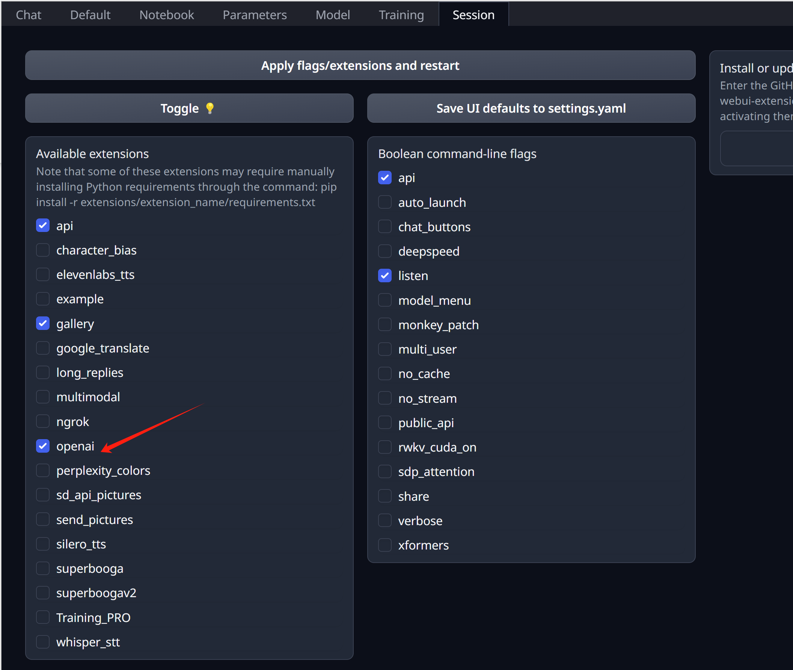
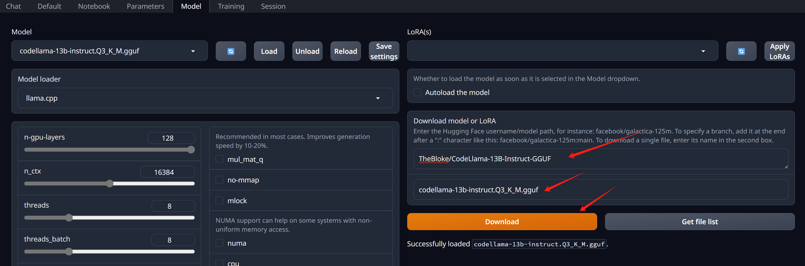
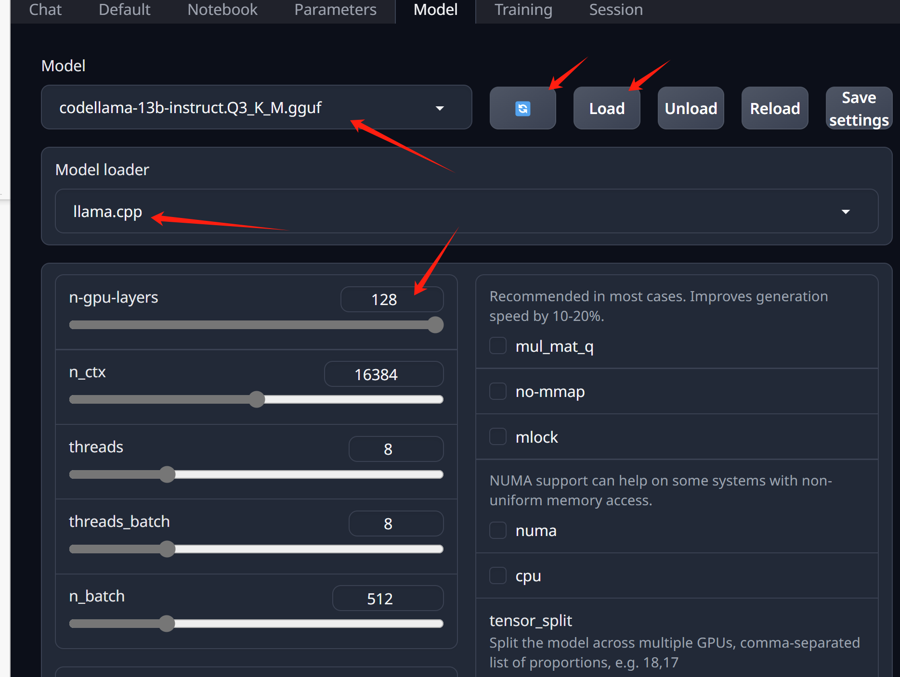

# 在 jetson 上运行 codellama 服务

我们想测试一下，在低功耗设备上，运行大语言模型的体验。我们一般的主机GPU是300瓦的，我们搞到一个低功耗设备，jetson，大概60瓦，算力是主机的1/10。就让我们来试试，这种设备运行大语言模型，是个什么情况。

我们先要根据nvidia官方的步骤，用sdk manager来初始化jetson，然后我们就用docker，来加载官方容器，运行runtime加载codellama模型。由于低功耗设备的限制，我们选择量化以后的模型测试

```bash
# 安装一些驱动
apt install nvidia-jetpack

# 启动官方容器镜像
mkdir -p /data.root/huggingface/

docker run --runtime nvidia -it --rm --network=host \
  -v /data.root/huggingface/:/data/huggingface/:Z \
  docker.io/dustynv/text-generation-webui:1.7-r35.4.1 bash

# 在容器的console里面，运行如下命令，启动服务
cd /opt/text-generation-webui && python3 server.py \
  --model-dir=/data/huggingface/ \
  --chat \
  --listen \
  --api

```

启动服务以后，我们在界面上操作就可以啦。
1. active openai in setting



2. 在 webui 中下载模型, TheBloke/CodeLlama-13B-Instruct-GGUF -> codellama-13b-instruct.Q5_K_M.gguf



3. 选择模型，配置参数，运行就好了



# 运行效果

是真的慢啊，2 token/s，而且量化以后的结果，质量有肉眼可见的下降。