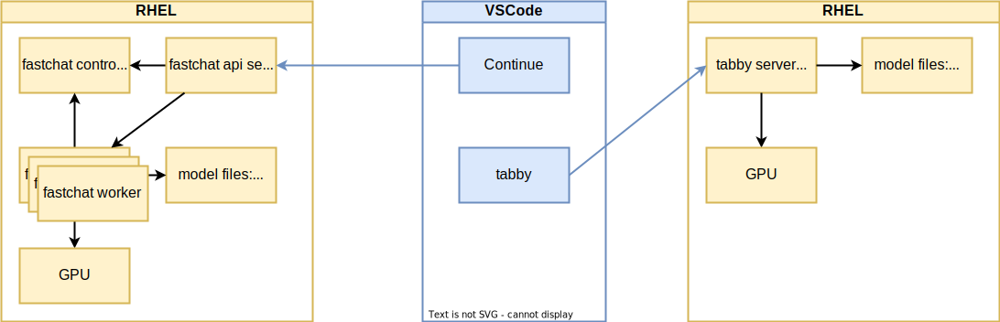
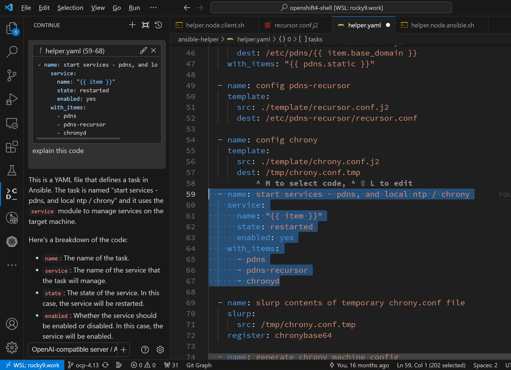

# 使用 code llama 配合 vscode 来做代码自动补全

github copilot 是非常优秀的vscode插件，可以让程序员访问到gpt-4的能力，做代码补全和问答，一切都在vscode里面，但是如果我们是企业应用场景，数据是不能离开企业局域网的，那么我们就需要自己搭建一个类似的内网服务，来做代码补全。

我们使用code llama来提供代码补全的服务，使用vscode来访问这个服务。

整体部署架构如下：



本文写作逻辑结构如下：



# 部署 code llama

我们选择 CodeLlama-34b-Instruct-hf 这个模型。

- https://huggingface.co/codellama/CodeLlama-34b-Instruct-hf

```bash
# we use fastchat to host code llama service

conda activate /data/env/jupyter
# conda deactivate

cd /data/workspace/jupyter/yanshu

# on a new tab, create control service
python -m fastchat.serve.controller

# on a new tab, create api service
python -m fastchat.serve.openai_api_server --host 0.0.0.0 --port 8000

# on a new tab, run the code llama service
python -m fastchat.serve.model_worker --model-path /data/huggingface/CodeLlama-34b-Instruct-hf 


```

# 部署 vscode 插件

我们使用vscode的插件 Continue， 来访问code llama服务。

- https://continue.dev/docs/intro

安装好 continue 插件以后，按照官方文档，我们做一下配置，后端服务指向 code llama

- https://continue.dev/docs/reference/Model%20Providers/openai


修改 ~/.continue/config.json , 把下面的配置，添加进去

```json
{
  "models": [
    {
      "title": "OpenAI-compatible server / API",
      "provider": "openai",
      "model": "CodeLlama-34b-Instruct-hf",
      "apiKey": "EMPTY",
      "apiBase": "http://172.21.6.105:8000"
    }
  ]
}

```

然后我们就赶快来试试吧。真的还不错呢。



# GPU 消耗

当我们通过vscode插件continue去访问code llama，来给代码提供各种分析的时候，GPU消耗还是很夸张的


我们可以看到, gpu 基本100%了。资源不够的话，只能选择小一些的模型了。