# 在 openshift4 上部署 codellama 服务，实现 vscode 代码自动补全

本文继续上一篇文章，我们在 openshift4 上部署 codellama 服务，实现 vscode 代码自动补全和LLM会话。

# 实验准备

openshift集群需要部署
- hostpath provisioner
- nvidia gpu operator
- normal user created (htpasswd)
- image registry backed by storage
- openshift pipeline
- openshift servicemesh
- openshift serverless
- openshift ods ( openshift ai )

## auto install service mesh and serverless

by now, it is ocp ai 2.5, you can auto install service mesh and serverless

- https://access.redhat.com/documentation/en-us/red_hat_openshift_ai_self-managed/2.5/html/working_on_data_science_projects/serving-large-language-models_serving-large-language-models#about-the-single-model-serving-platform_serving-large-language-models

openshift ai会使用knative(serverless)的方式暴露服务，默认是https方式，作者还不知道怎么配置弄成http方式暴露，https方式暴露，就涉及到证书问题，需要弄一个合法的通配符证书。

注意，https方式暴露服务，还有一个问题，就是odf相关服务，需要在单独的一个namespace里面，也就是用ods来创建这个namespace，之后这个namespace就不要干别的了。否则会和openshift router冲突。

# 镜像制作

## S3 for codellama 13B

```bash
# on 105
mkdir -p /data/workspace/s3.codellama
cd /data/workspace/s3.codellama

rsync -P -ar /data/huggingface/CodeLlama-13b-Instruct-hf /data/workspace/s3.codellama/

rm -f /data/workspace/s3.codellama/CodeLlama-13b-Instruct-hf/*.safetensors

cd /data/workspace/s3.codellama

cat << 'EOF' > Dockerfile
FROM quay.io/cloudservices/minio:RELEASE.2021-06-17T00-10-46Z.hotfix.35a0912ff as minio-examples

EXPOSE 9000

ARG MODEL_DIR=/data1/models

USER root

RUN useradd -u 1000 -g 0 modelmesh
RUN mkdir -p ${MODEL_DIR}
RUN chown -R 1000:0 /data1 && \
    chgrp -R 0 /data1 && \
    chmod -R g=u /data1

COPY --chown=1000:0 CodeLlama-13b-Instruct-hf ${MODEL_DIR}/CodeLlama-13b-Instruct-hf

USER 1000

EOF

podman build -t quaylab.infra.wzhlab.top:7443/wangzheng422/qimgs:minio-codellama-13-instruct-hf -f Dockerfile .

podman push quaylab.infra.wzhlab.top:7443/wangzheng422/qimgs:minio-codellama-13-instruct-hf

```

### deploy on ocp

```bash

oc new-project llm-demo
oc label --overwrite ns llm-demo \
   pod-security.kubernetes.io/enforce=privileged

# on helper
S3_NAME='codellama'
S3_NS='llm-demo'
S3_IMAGE='quaylab.infra.wzhlab.top:7443/wangzheng422/qimgs:minio-codellama-13-instruct-hf'

cat << EOF > ${BASE_DIR}/data/install/s3-codellama.yaml
---
apiVersion: v1
kind: Service
metadata:
  name: minio-${S3_NAME}
spec:
  ports:
    - name: minio-client-port
      port: 9000
      protocol: TCP
      targetPort: 9000
  selector:
    app: minio-${S3_NAME}

---
apiVersion: route.openshift.io/v1
kind: Route
metadata:
  name: s3-${S3_NAME}
spec:
  to:
    kind: Service
    name: minio-${S3_NAME}
  port:
    targetPort: 9000

---
apiVersion: apps/v1
kind: Deployment
metadata:
  name: minio-${S3_NAME}
  labels:
    app: minio-${S3_NAME}
spec:
  replicas: 1
  selector:
    matchLabels:
      app: minio-${S3_NAME}
  template:
    metadata:
      labels:
        app: minio-${S3_NAME}
    spec:
      containers:
        - args:
            - server
            - /data1
          env:
            - name: MINIO_ACCESS_KEY
              value:  admin
            - name: MINIO_SECRET_KEY
              value: password
          image: ${S3_IMAGE}
          imagePullPolicy: IfNotPresent
          name: minio
          nodeSelector:
            kubernetes.io/hostname: "worker-01-demo"
          securityContext:
            allowPrivilegeEscalation: false
            capabilities:
                drop:
                - ALL
            runAsNonRoot: true
            seccompProfile:
                type: RuntimeDefault

---
apiVersion: v1
kind: Secret
metadata:
  annotations:
    serving.kserve.io/s3-endpoint: minio-${S3_NAME}.${S3_NS}.svc:9000 # replace with your s3 endpoint e.g minio-service.kubeflow:9000
    serving.kserve.io/s3-usehttps: "0" # by default 1, if testing with minio you can set to 0
    serving.kserve.io/s3-region: "us-east-2"
    serving.kserve.io/s3-useanoncredential: "false" # omitting this is the same as false, if true will ignore provided credential and use anonymous credentials
  name: storage-config-${S3_NAME}
stringData:
  "AWS_ACCESS_KEY_ID": "admin"
  "AWS_SECRET_ACCESS_KEY": "password"

---
apiVersion: v1
kind: ServiceAccount
metadata:
  name: sa-${S3_NAME}
secrets:
- name: storage-config-${S3_NAME}

EOF

oc create -n llm-demo -f ${BASE_DIR}/data/install/s3-codellama.yaml

# oc delete -n llm-demo -f ${BASE_DIR}/data/install/s3-codellama.yaml

# open in browser to check
# http://s3-codellama-llm-demo.apps.demo-gpu.wzhlab.top/minio/models/
# http://s3-codellama-llm-demo.apps.demo-gpu.wzhlab.top/minio/models/CodeLlama-13b-Instruct-hf/


```

## S3 for tabby 13B

```bash
# on 105
cd /data/workspace/tabby

cat << 'EOF' > Dockerfile
FROM quay.io/cloudservices/minio:RELEASE.2021-06-17T00-10-46Z.hotfix.35a0912ff as minio-examples

EXPOSE 9000

ARG MODEL_DIR=/data1/

USER root

RUN useradd -u 1000 -g 0 modelmesh
RUN mkdir -p ${MODEL_DIR}
RUN chown -R 1000:0 /data1 && \
    chgrp -R 0 /data1 && \
    chmod -R g=u /data1

COPY --chown=1000:0 models ${MODEL_DIR}/models/models

USER 1000

EOF

podman build -t quaylab.infra.wzhlab.top:7443/wangzheng422/qimgs:minio-tabby-v01 -f Dockerfile .

podman push quaylab.infra.wzhlab.top:7443/wangzheng422/qimgs:minio-tabby-v01

```

### deploy on ocp

```bash

# on helper
S3_NAME='tabby'
S3_NS='llm-demo'
S3_IMAGE='quaylab.infra.wzhlab.top:7443/wangzheng422/qimgs:minio-tabby-v01'

cat << EOF > ${BASE_DIR}/data/install/s3-tabby.yaml
---
apiVersion: v1
kind: Service
metadata:
  name: minio-${S3_NAME}
spec:
  ports:
    - name: minio-client-port
      port: 9000
      protocol: TCP
      targetPort: 9000
  selector:
    app: minio-${S3_NAME}

---
apiVersion: route.openshift.io/v1
kind: Route
metadata:
  name: s3-${S3_NAME}
spec:
  to:
    kind: Service
    name: minio-${S3_NAME}
  port:
    targetPort: 9000

---
apiVersion: apps/v1
kind: Deployment
metadata:
  name: minio-${S3_NAME}
  labels:
    app: minio-${S3_NAME}
spec:
  replicas: 1
  selector:
    matchLabels:
      app: minio-${S3_NAME}
  template:
    metadata:
      labels:
        app: minio-${S3_NAME}
    spec:
      containers:
        - args:
            - server
            - /data1
          env:
            - name: MINIO_ACCESS_KEY
              value:  admin
            - name: MINIO_SECRET_KEY
              value: password
          image: ${S3_IMAGE}
          imagePullPolicy: IfNotPresent
          name: minio
          nodeSelector:
            kubernetes.io/hostname: "worker-01-demo"
          securityContext:
            allowPrivilegeEscalation: false
            capabilities:
                drop:
                - ALL
            runAsNonRoot: true
            seccompProfile:
                type: RuntimeDefault

---
apiVersion: v1
kind: Secret
metadata:
  annotations:
    serving.kserve.io/s3-endpoint: minio-${S3_NAME}.${S3_NS}.svc:9000 # replace with your s3 endpoint e.g minio-service.kubeflow:9000
    serving.kserve.io/s3-usehttps: "0" # by default 1, if testing with minio you can set to 0
    serving.kserve.io/s3-region: "us-east-2"
    serving.kserve.io/s3-useanoncredential: "false" # omitting this is the same as false, if true will ignore provided credential and use anonymous credentials
  name: storage-config-${S3_NAME}
stringData:
  "AWS_ACCESS_KEY_ID": "admin"
  "AWS_SECRET_ACCESS_KEY": "password"

---
apiVersion: v1
kind: ServiceAccount
metadata:
  name: sa-${S3_NAME}
secrets:
- name: storage-config-${S3_NAME}

EOF

oc create -n llm-demo -f ${BASE_DIR}/data/install/s3-tabby.yaml

# oc delete -n llm-demo -f ${BASE_DIR}/data/install/s3-tabby.yaml

# open in browser to check
# http://s3-tabby-llm-demo.apps.demo-gpu.wzhlab.top/minio/models/
# http://s3-tabby-llm-demo.apps.demo-gpu.wzhlab.top/minio/models/TabbyML/

```

## image for simple openai service

### try on cli

```bash

# on 105

mkdir -p /data/env/
conda create -y -p /data/env/openllm python=3.10

conda init bash

conda activate /data/env/openllm
# conda deactivate

# pip install -U openllm

pip install -U vllm

# openllm start --backend vllm --debug /data/huggingface/CodeLlama-13b-Instruct-hf 
python -m vllm.entrypoints.openai.api_server \
  --served-model-name CodeLlama-13b-Instruct-hf \
  --model /data/huggingface/CodeLlama-13b-Instruct-hf


```

vllm provides docker image
- https://docs.vllm.ai/en/latest/serving/deploying_with_docker.html
- docker.io/vllm/vllm-openai:latest

# 在 openshift ai 上部署

## for codellama

### 创建 ServingRuntime

openshift ai默认带的serving runtime，用的是caikit-tgis， 对外接口是grpc模式， url path也和普通的openai api不一样，我们就需要自定义一个新的ServingRuntime，来承载LLM，对外保留openai API接口。

找了半天，发现vLLM整合我意，并且意外的（情理之中），红帽官方的实验项目也更新了，也提到了使用vLLM来做一个新的ServingRuntime承载大语言模型。

- https://github.com/rh-aiservices-bu/llm-on-openshift/blob/main/vllm_runtime/README.md

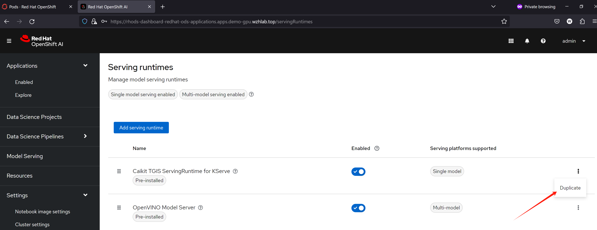

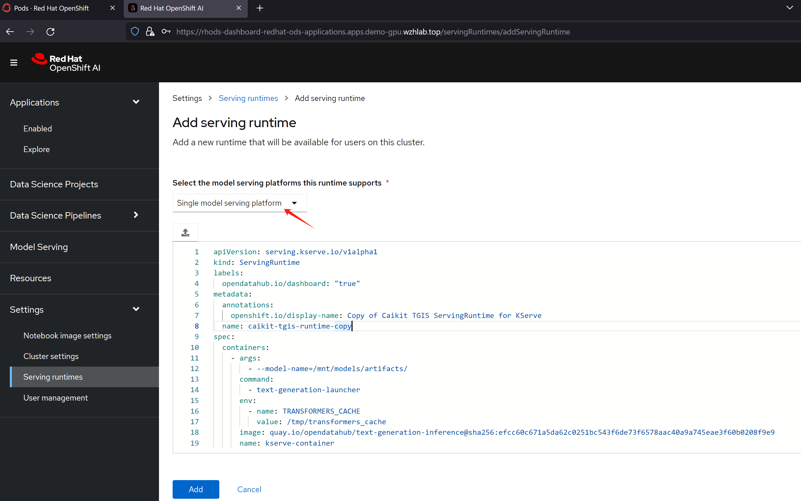

把yaml内容，替换成下面的，保存就可以了。

```yaml
apiVersion: serving.kserve.io/v1alpha1
kind: ServingRuntime
labels:
  opendatahub.io/dashboard: "true"
metadata:
  annotations:
    openshift.io/display-name: vllm-runtime
  name: vllm-runtime
spec:
  builtInAdapter:
    modelLoadingTimeoutMillis: 900000
  containers:
    - args:
        - --served-model-name
        - CodeLlama-13b-Instruct-hf
        - --model
        - /mnt/models/
        - --max-model-len
        - "11200"
      env:
        - name: TRANSFORMERS_CACHE
          value: /tmp/transformers_cache
        - name: RUNTIME_LOCAL_MODELS_DIR
          value: /mnt/models
        - name: RUNTIME_GRPC_SERVER_THREAD_POOL_SIZE
          value: "64"
      image: docker.io/vllm/vllm-openai:latest
      name: kserve-container
      ports:
        - containerPort: 8000
          protocol: TCP
  multiModel: false
  supportedModelFormats:
    - autoSelect: true
      name: pytorch
```

### 部署模型

在部署模型之前，我们定义一个S3存储，用来给应用提供大模型文件。

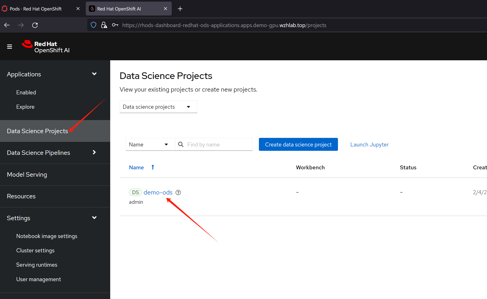

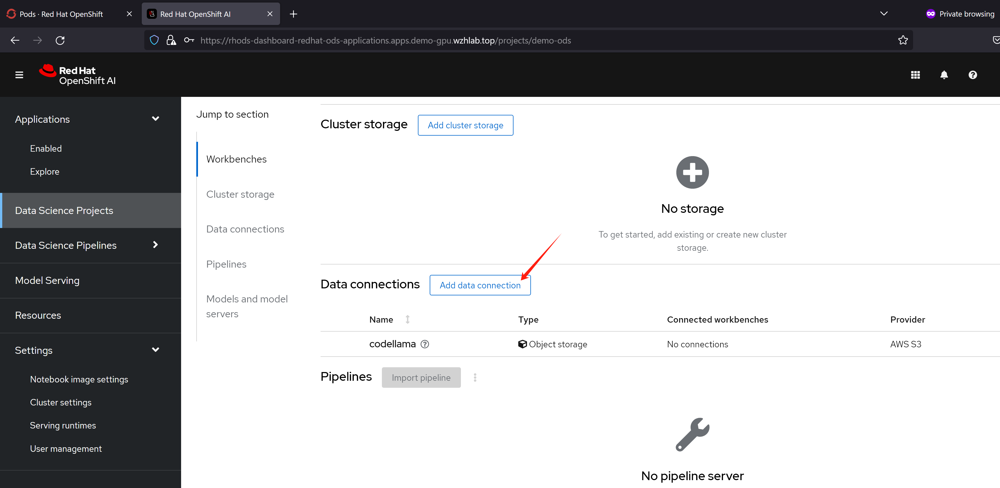

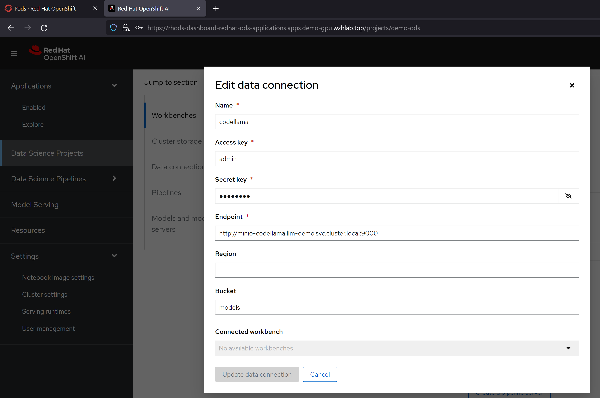

然后，我们就可以使用我们定义的servingruntime, s3存储，来定义一个模型服务了。

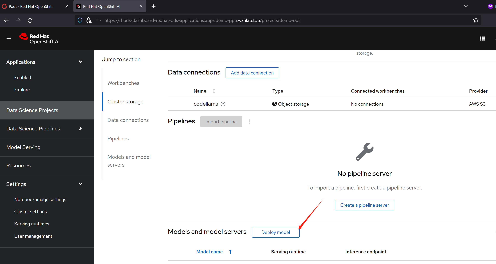

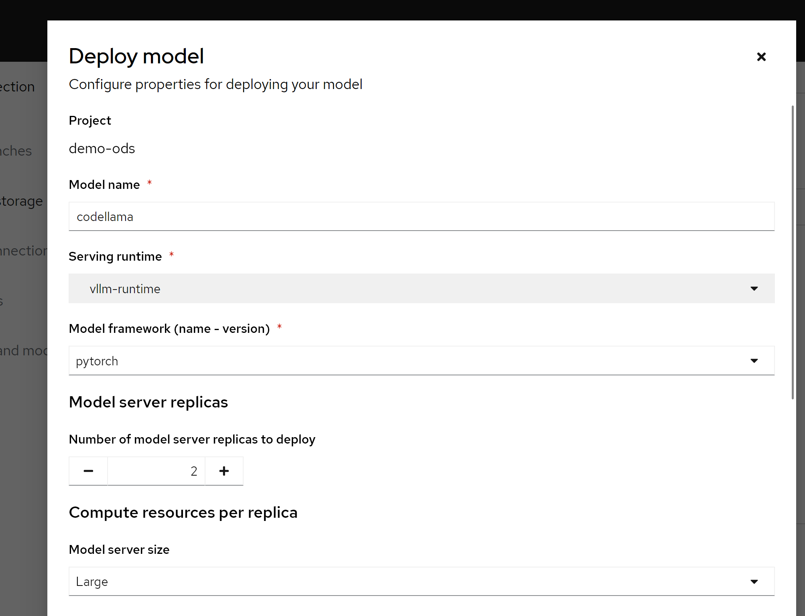

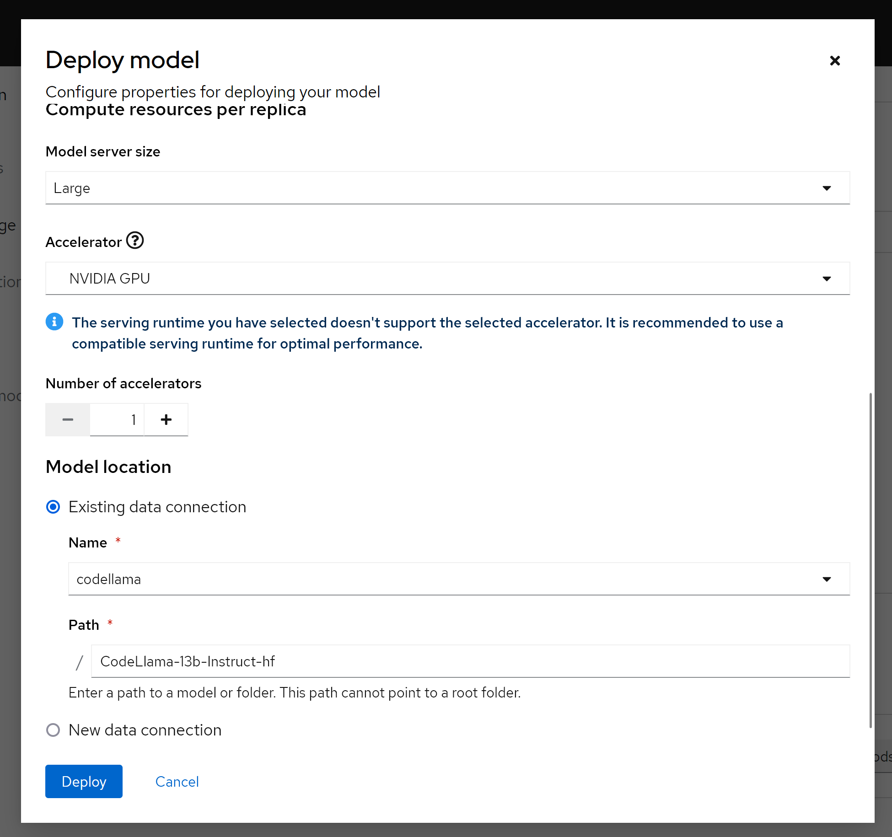

保存以后，我们就能看到，他通过knative，创建了一个服务。

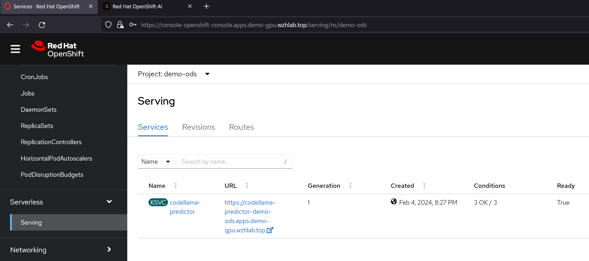

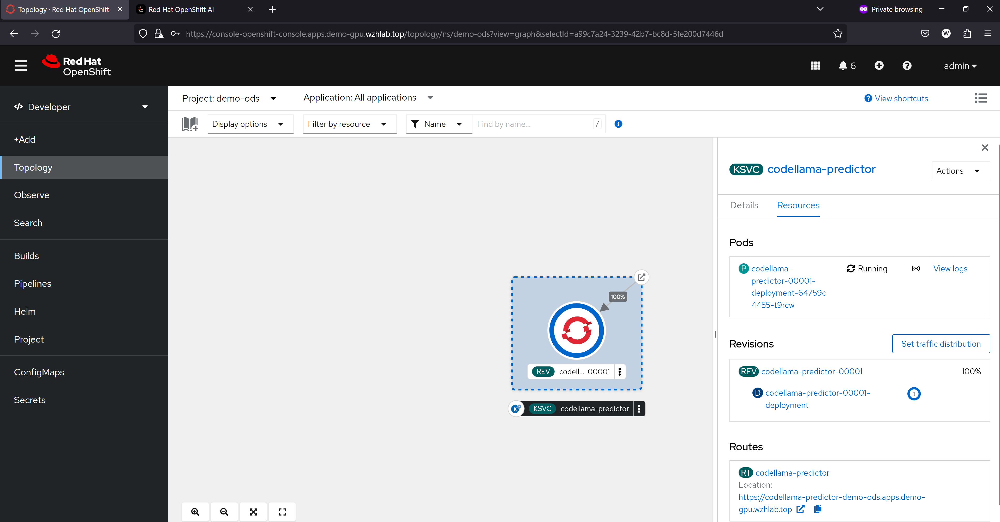

### 效果体验

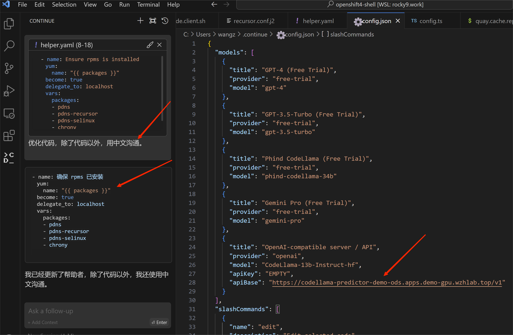

## for tabby

### 创建 ServingRuntime

```yaml

apiVersion: serving.kserve.io/v1alpha1
kind: ServingRuntime
labels:
  opendatahub.io/dashboard: "true"
metadata:
  annotations:
    openshift.io/display-name: tabby-runtime
  name: tabby-runtime
spec:
  builtInAdapter:
    modelLoadingTimeoutMillis: 900000
  containers:
    - name: kserve-container
      command: [ "/bin/bash","-c","--" ]
      args: ["rm -rf /data/*; mkdir -p /data/models; ln -s /mnt/models/TabbyML /data/models/; /opt/tabby/bin/tabby serve --model TabbyML/CodeLlama-13B --device cuda" ]
      image: docker.io/tabbyml/tabby
      imagePullPolicy: IfNotPresent
      env:
        - name: TRANSFORMERS_CACHE
          value: /tmp/transformers_cache
        - name: RUNTIME_LOCAL_MODELS_DIR
          value: /mnt/models/
        - name: RUNTIME_GRPC_SERVER_THREAD_POOL_SIZE
          value: "64"
      ports:
        - containerPort: 8080
          protocol: TCP
      volumeMounts:
        - name: model-data
          mountPath: "/data/"
  volumes:
    - name: model-data
      emptyDir: {}
  multiModel: false
  supportedModelFormats:
    - autoSelect: true
      name: pytorch

```